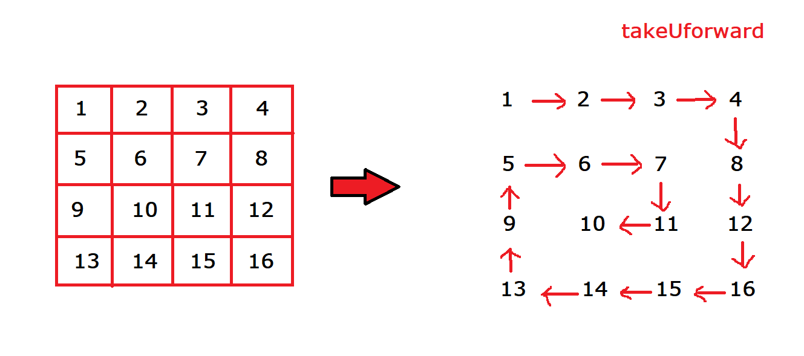

# Array

# wave print a matrix
```cpp
Input: mat[][] = {{  1,   2,   3,   4}
                           {  5,   6,   7,   8}
                           {  9, 10, 11, 12}
                           {13, 14, 15, 16}
                           {17, 18, 19, 20}}
Output: 1 5 9 13 17 18 14 10 6 2 3 7 11 15 19 20 16 12 8 4 
```

```cpp
void wavePrint(int arr[3][4],int n,int m){
    int i = 0,j = 0;

    while(j<m){
        if(j&1){
            // j odd 
            i = n-1;
            while(i>=0){
                cout<<arr[i][j]<<" ";
                i--;
            }
        }
        else{
            // j is even 0 2 4
            i = 0;
            while(i<n){
                cout<<arr[i][j]<<" ";
                i++;
            }
        }
        cout<<endl;
        j++;

    }
}


```
## reverseWave

```cpp
Input :  1  9  4  10
         3  6  90 11
         2  30 85 72
         6  31 99 15 
Output : 10 11 72 15 99 85 90 4 9 6 30 31 6 2 3 1
```

```cpp

void ReverseWavePrint(int arr[4][4], int n, int m)
{
    int i = 0, j = m - 1;

    while (j >= 0)
    {
        if (j & 1)
        {
            // j odd // 1 3
            i = 0;
            while (i < n)
            {
                cout << arr[i][j] << " ";
                i++;
            }
        }
        else
        {
            // j is even 0 2 4
            i = n - 1;
            while (i >= 0)
            {
                cout << arr[i][j] << " ";
                i--;
            }
        }
        cout << endl;
        j--;
    }
}
```
# Print Matrix in Z form

```cpp
 Input: [[4, 5, 6, 8], 
            [1, 2, 3, 1], 
            [7, 8, 9, 4], 
            [1, 8, 7, 5]]
        
    Output: 4 5 6 8
                3
              8
            1 8 7 5
```

```cpp
void ZFormPrint(int arr[4][4], int n, int m)
{
    int i = 0, j = m - 1;

    for(int i = 0;i<n;i++){
        for(int j = 0;j<m;j++){
            if(i == 0 || i == n-1 || i+j == m-1){
                cout<<arr[i][j]<<" ";
            }
            else{
                cout<<"  ";
            }
        }
        cout<<endl;
    }

}

```
## Print a given matrix in zigzag form

```cpp
Input : 
        1    2   3   4   5
        6    7   8   9   10
        11   12  13  14  15
        16  17  18  19   20
Output :
1 2 3 4 5 10 9 8 7 6 11 12 13 14 15 20 19 18 17 16 
```

```cpp
void zigZagPrint(int arr[4][4], int n, int m)
{
    int i = 0, j = 0;

    while (i < n)
    {
        if (i & 1)
        {
            // j odd // 1 3
            j = m - 1;
            while (j >= 0)
            {
                cout << arr[i][j] << " ";
                j--;
            }
        }
        else
        {
            // j is even 0 2 4
            j = 0;
            while (j < n)
            {
                cout << arr[i][j] << " ";
                j++;
            }
        }
        cout << endl;
        i++;
    }
}

```

## Spiral Traversal of Matrix



```cpp
Input: matrix = {{1,    2,   3,   4},
              {5,    6,   7,   8},
              {9,   10,  11,  12},
            {13,  14,  15,  16 }}
Output: 1 2 3 4 8 12 16 15 14 13 9 5 6 7 11 10 
```

```cpp
void SpiralPrint(int arr[5][5], int n, int m)
{
    int top = 0, bottom = n - 1;
    int left = 0, right = m - 1;

    // spriral movement  -->
    // 1. go right (left to right)
    // 2. go bottom (top to bottom)
    // 3. go left (right to left)
    // 4. go up (bottom to up)

    while (top <= bottom && right >= left)
    {

        // 1. go right (left to right)
        for (int i = left; i <= right; i++)
        {
            cout << arr[top][i] << " ";
        }
        top++;
        // 2. go bottom (top to bottom)
        for (int i = top; i <= bottom; i++)
        {
            cout << arr[i][right] << " ";
        }
        right--;
        // 3. go left (right to left)
        if (top <= bottom)
        {
            for (int i = right; i >= left; i--)
            {
                cout << arr[bottom][i] << " ";
            }
        }
        bottom--;
        // 4. go up (bottom to up)
        if (left <= right)
        {
            for (int i = bottom; i >= top; i--)
            {
                cout << arr[i][left] << " ";
            }
        }
        left++;
    }
}
```

```cpp

```

```cpp

```

```cpp

```

```cpp

```

```cpp

```

```cpp

```


