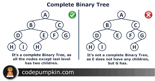
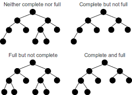

# Heap
- Data structure that is complete Binary Tree Plus Hold a Heap property
- All levels should be complete except last level and filling of node should be strictly from left to right 
- if right node is present without left node then it is not a complete Binary tree


 


# Creating Heap

- create hum array my karegy but visuallise hum as a tree karege

- MaxHeap --> root bada hota hai child sy
- MinHeap --> root chota hota hai child sy


```cpp

```

```cpp

```

```cpp

```

```cpp

```

```cpp

```
# minHeap and maxHeap using STL

```cpp
int main(){

    priority_queue<int>maxHeap;
    priority_queue<int,vector<int>,greater<int>>minHeap;
    
    maxHeap.push(10);
    maxHeap.push(1);
    maxHeap.push(13);
    maxHeap.push(199);
    maxHeap.push(3);
    maxHeap.push(7);
    maxHeap.push(8);

    minHeap.push(10);
    minHeap.push(1);
    minHeap.push(13);
    minHeap.push(199);
    minHeap.push(3);
    minHeap.push(7);
    minHeap.push(8);

    cout<<"printing maxheap "<<endl;
    while(!maxHeap.empty())
    {
        cout<<maxHeap.top()<<" ";
        maxHeap.pop();
    }
    cout<<endl;
    cout<<"printing minHeap "<<endl;
    while(!minHeap.empty())
    {
        cout<<minHeap.top()<<" ";
        minHeap.pop();
    }
    

    return 0;

}


```

```cpp

```

```cpp

```

```cpp

```

```cpp

```

```cpp

```

```cpp

```