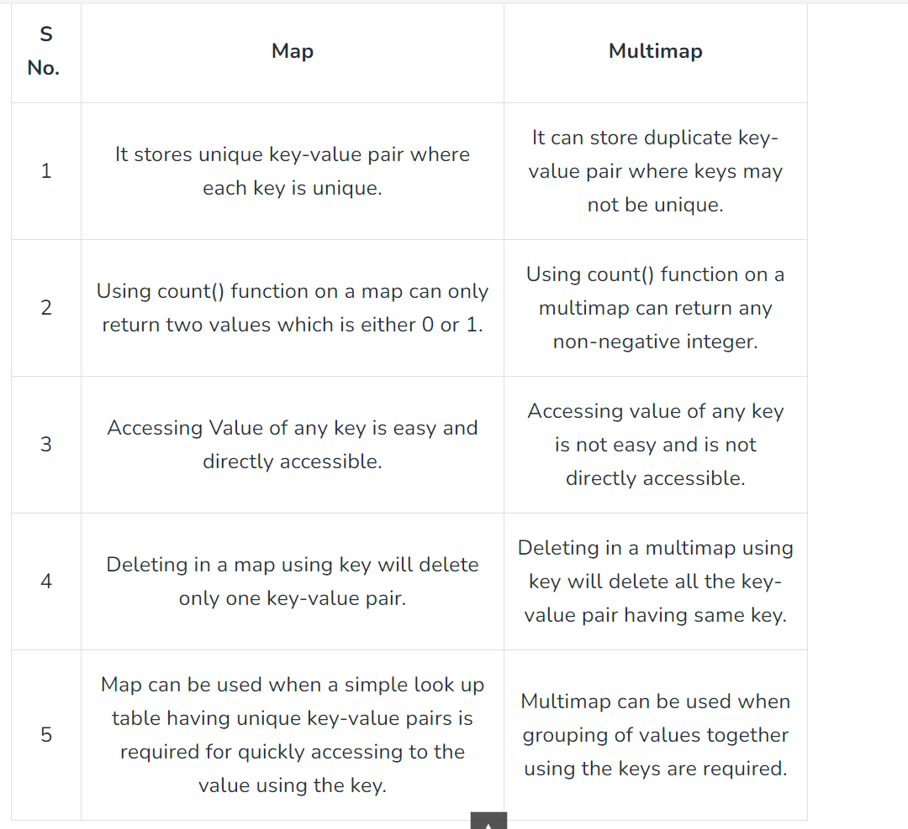

# Map

Map stores unique key-value pairs in a sorted manner. Each key is uniquely associated with a value that may or may not be unique. A key can be inserted or deleted from a map but cannot be modified. Values assigned to keys can be changed. It is a great way for quickly accessing value using the key and it is done in O(1) time

# MultiMap

Multimap is similar to map with an addition that multiple elements can have same keys. Also, it is NOT required that the key value and mapped value pair has to be unique in this case. One important thing to note about multimap is that multimap keeps all the keys in sorted order always. These properties of multimap makes it very much useful in competitive programming.




# map<int,vector<int>>mp can be used as multimap;

# Understanding `map` and `multimap` in C++

In C++, `map` and `multimap` are two of the associative containers provided by the Standard Template Library (STL). Both are used to store key-value pairs, but they have some key differences. In this article, we'll explore how to use `map` and `multimap`, including their methods and some practical examples.

## Overview

- **`map`**: A sorted associative container that contains key-value pairs with unique keys. Each key maps to exactly one value.
- **`multimap`**: Similar to `map`, but allows multiple elements to have the same key. Each key can map to multiple values.

## `map` Methods

A `map` is implemented as a balanced binary search tree (usually a Red-Black Tree). Here are some common methods used with `map`:

### 1. **`insert`**

Inserts a key-value pair into the map.

```cpp
#include <iostream>
#include <map>

using namespace std;

int main() {
    map<int, string> myMap;

    // Insert elements
    myMap.insert(pair<int, string>(1, "One"));
    myMap.insert(make_pair(2, "Two"));
    myMap[3] = "Three";

    for (const auto& elem : myMap) {
        cout << elem.first << ": " << elem.second << endl;
    }

    return 0;
}
```

### 2. **`find`**

Finds an element with a specified key.

```cpp
#include <iostream>
#include <map>

using namespace std;

int main() {
    map<int, string> myMap = {{1, "One"}, {2, "Two"}, {3, "Three"}};

    auto it = myMap.find(2);
    if (it != myMap.end()) {
        cout << "Element found: " << it->first << " -> " << it->second << endl;
    } else {
        cout << "Element not found" << endl;
    }

    return 0;
}
```

### 3. **`erase`**

Removes elements from the map.

```cpp
#include <iostream>
#include <map>

using namespace std;

int main() {
    map<int, string> myMap = {{1, "One"}, {2, "Two"}, {3, "Three"}};

    // Erase element by key
    myMap.erase(2);

    // Print remaining elements
    for (const auto& elem : myMap) {
        cout << elem.first << ": " << elem.second << endl;
    }

    return 0;
}
```

### 4. **`clear`**

Removes all elements from the map.

```cpp
#include <iostream>
#include <map>

using namespace std;

int main() {
    map<int, string> myMap = {{1, "One"}, {2, "Two"}, {3, "Three"}};

    myMap.clear();

    cout << "Size of map after clear: " << myMap.size() << endl;

    return 0;
}
```

## `multimap` Methods

A `multimap` is similar to a `map`, but it allows multiple values for the same key. Here are some common methods:

### 1. **`insert`**

Inserts a key-value pair into the multimap.

```cpp
#include <iostream>
#include <map>

using namespace std;

int main() {
    multimap<int, string> myMultiMap;

    // Insert elements
    myMultiMap.insert(pair<int, string>(1, "One"));
    myMultiMap.insert(make_pair(1, "Uno"));
    myMultiMap.insert(make_pair(2, "Two"));
    myMultiMap.insert(make_pair(3, "Three"));

    for (const auto& elem : myMultiMap) {
        cout << elem.first << ": " << elem.second << endl;
    }

    return 0;
}
```

### 2. **`find`**

Finds the first element with a specified key.

```cpp
#include <iostream>
#include <map>

using namespace std;

int main() {
    multimap<int, string> myMultiMap = {{1, "One"}, {1, "Uno"}, {2, "Two"}, {3, "Three"}};

    auto range = myMultiMap.equal_range(1);
    cout << "Elements with key 1:" << endl;
    for (auto it = range.first; it != range.second; ++it) {
        cout << it->first << ": " << it->second << endl;
    }

    return 0;
}
```

### 3. **`erase`**

Removes elements from the multimap.

```cpp
#include <iostream>
#include <map>

using namespace std;

int main() {
    multimap<int, string> myMultiMap = {{1, "One"}, {1, "Uno"}, {2, "Two"}, {3, "Three"}};

    // Erase elements with key 1
    myMultiMap.erase(1);

    // Print remaining elements
    for (const auto& elem : myMultiMap) {
        cout << elem.first << ": " << elem.second << endl;
    }

    return 0;
}
```

### 4. **`clear`**

Removes all elements from the multimap.

```cpp
#include <iostream>
#include <map>

using namespace std;

int main() {
    multimap<int, string> myMultiMap = {{1, "One"}, {1, "Uno"}, {2, "Two"}, {3, "Three"}};

    myMultiMap.clear();

    cout << "Size of multimap after clear: " << myMultiMap.size() << endl;

    return 0;
}
```

## Conclusion

Both `map` and `multimap` are powerful associative containers in C++. Use `map` when you need unique keys and `multimap` when you need to store multiple values for the same key. By understanding their methods and functionalities, you can make effective use of these containers in your C++ programs.