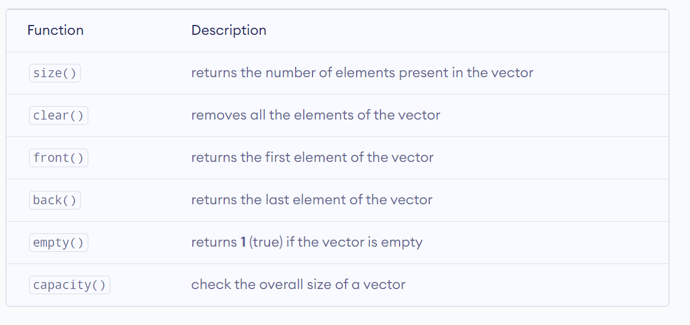
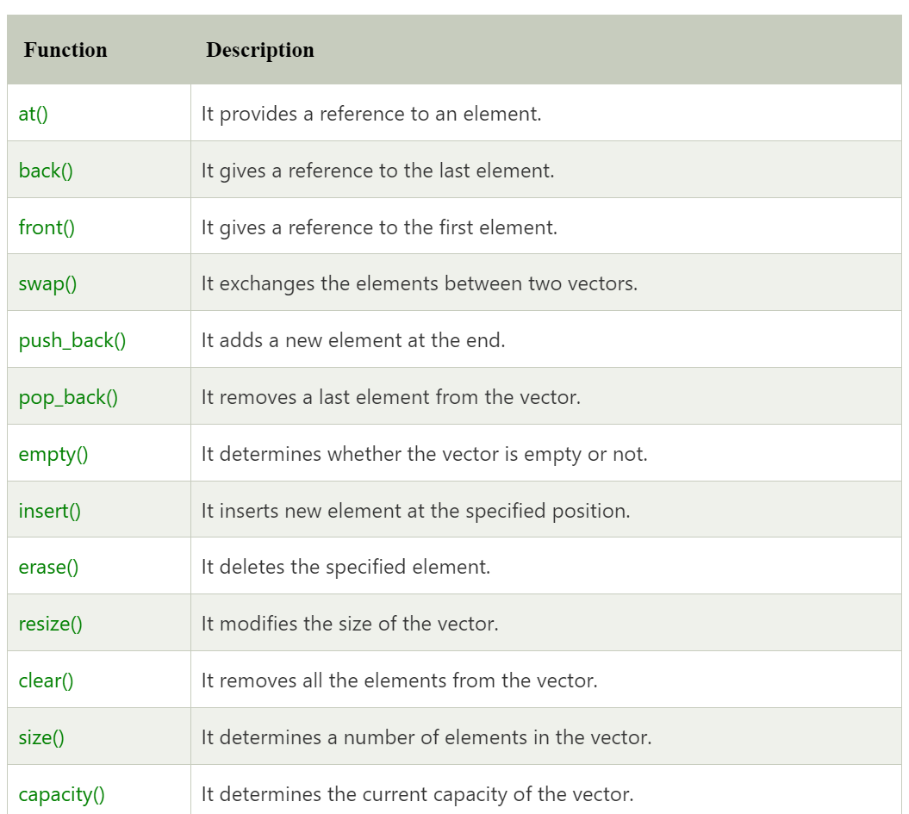
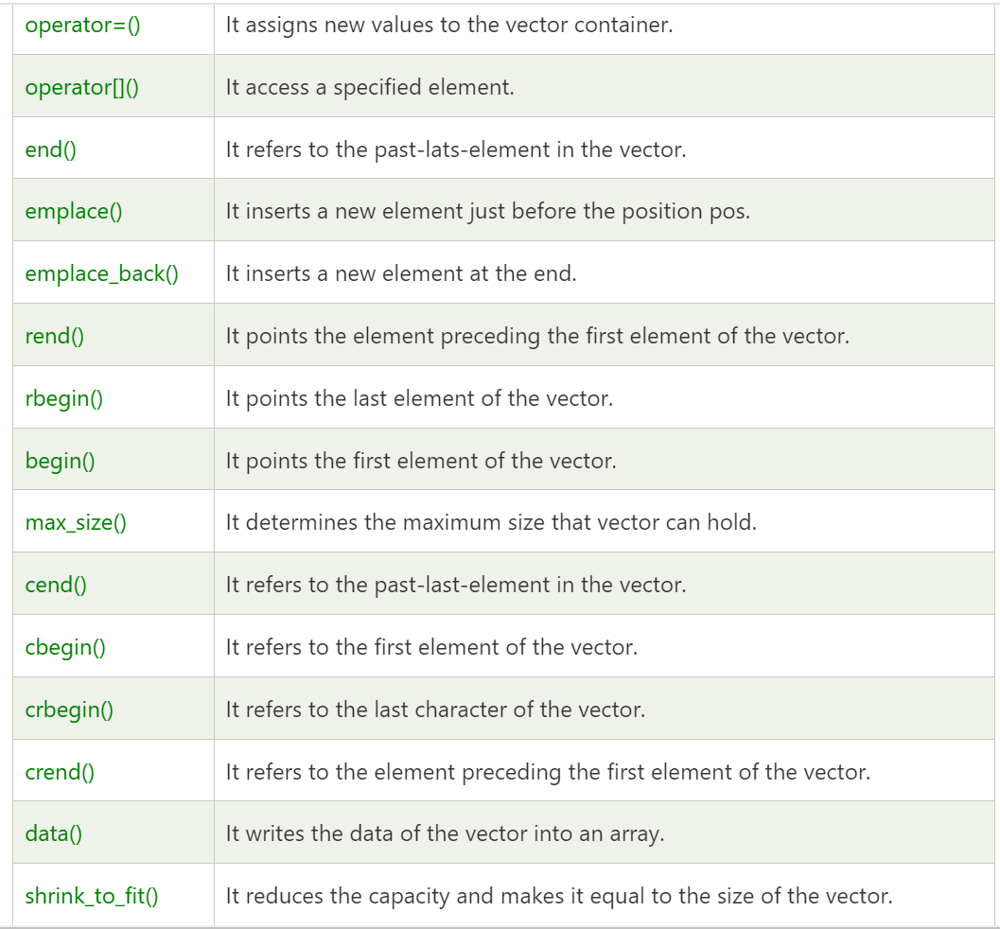

# Array

## Vector STL

- syntax

```cpp
vector<int>arr;
```

```cpp
vector<int>arr(n); // size
```

```cpp
vector<int>arr(n,-1);// size, value
```

# vector methods







## pair sum
```cpp

void pair_sum_bruteforce(int a[], int na, int b[], int nb,int target)
{   
    int ans[2];

    for (int i = 0; i < na; i++)
    {
        for(int j = 0;j<nb;j++){
            if(a[i]+b[j] == target){
                ans[0] = i;
                ans[1] = j;
                break;
            }
        }
    }

    cout<<ans[0]<<" "<<ans[1];
}
```
## find unique

- M1: All duplicate elements 2 times

```cpp
void findUnique(int arr[],int n){
    int ans = 0;

    for(int i = 0;i<n;i++){
        ans = ans^arr[i]; // xor
    }

    cout<<"unique element is "<<ans<<endl;
}

```
- M2: using Hash map

```cpp
int findUniqueHashing(int a[], int n, int k)
{
    int ans = -1;

    map<int, int> freqMap; // Create an unordered_map to store frequency

    // Populate the frequency map
    for (int i = 0; i < n; i++)
    {
        int num = a[i];
        freqMap[num]++; // Increment the frequency of the current element
    }

    for (auto it : freqMap)
    {
        // cout<<it.first<<"-> "<<it.second<<endl;
        if (it.second % k != 0)
        { // not multiple of k
            ans = it.first;
            break;
        }
    }

    return ans;
}
```
## Sort Zeros and Ones 
```cpp
void sortZeroAndOne(int arr[], int n)
{
    int i = 0, j = n - 1;

    while (i < j)
    {
        // cout<<i<<" "<<j<<endl;
        bool cond1 = (arr[i] == 0);
        bool cond2 = (arr[j] == 1);
        if (cond1)
        { // sahi jagh py hai
            i++;
        }
        if(cond2){
            j--;
        }
        
        if(!cond1 && !cond2){
            cout<<" cond"<<endl;
            swap(arr[i],arr[j]);
        }
    }
    
}

```

# 2D Vector

```cpp
 // declaration
    vector<vector<int>> v;

    vector<vector<int>> v1{{1, 2, 3, 4},
                         {1, 2, 3, 4}};

    // intialise with some value
    vector<vector<int>> v2(10, vector<int>(10, 0)); // (size, value of row)
```


# move negative to one side
```cpp
void moveNegative(int arr[], int n)
{
    int i = 0, j = n - 1;

    while (i < j)
    {
        bool cond1 = (arr[i] < 0); // positive numbe
        bool cond2 = (arr[j] > 0); // negative number

        if (cond1)
        {
            i++; // positive number in front
        }

        if (cond2)
        {
            j--; // negative number in the end
        }

        if (!cond1 && !cond2)
        {
            swap(arr[i], arr[j]);
        }
    }

}
```


```cpp

```

# find duplicates

```cpp
void findDuplicate_ByNegativeMarking(int arr[], int n)
{
    // vector<int>ans;
        int n = arr.size();
        for (int i = 0; i < n; i++) {
            int index = abs(arr[i]) - 1; // -1 bcuz [1,n] // kyuki ho skta kisi
                                         // ny isko -ve kar diya hoga
            if (arr[index] < 0) {
                // phele he kisi ny mark kar diya
                cout << abs(index + 1) << " is a duplicate" << endl;
                // ans.push_back(index+1);
            } else {
                arr[index] = -arr[index];
            }
        }

        // if(ans.empty()){
        //     cout<<"No duplicates"
        //     // return {};
        // }

        // return ans;
}

```


```cpp

```


```cpp

```

# common element in three sorted array

```cpp
vector<int> commonElement(int a[], int b[], int c[], int na, int nb, int nc)
{
    vector<int> ans;
    int i = 0;
    int j = 0;
    int k = 0;

    while (i < a.size() && j < b.size() && k < c.size())
    {
        if (a[i] == b[j] && b[j] == c[k])
        {
            if (ans.empty() || ans.back() != a[i])
            {
                ans.push_back(a[i]);
            }
            i++;
            j++;
            k++;
        }
        else if (a[i] < b[j])
        {
            i++;
        }
        else if (b[j] < c[k])
        {
            j++;
        }
        else
        {
            k++;
        }
    }
    return ans;

    // cout<<"completed"<<endl;
}


```


```cpp

```


```cpp

```


```cpp

```


```cpp

```


```cpp

```


```cpp

```


```cpp

```


```cpp

```


```cpp

```


```cpp

```


```cpp

```


```cpp

```


```cpp

```


```cpp

```


```cpp

```


```cpp

```


```cpp

```


```cpp

```


```cpp

```


```cpp

```


```cpp

```


