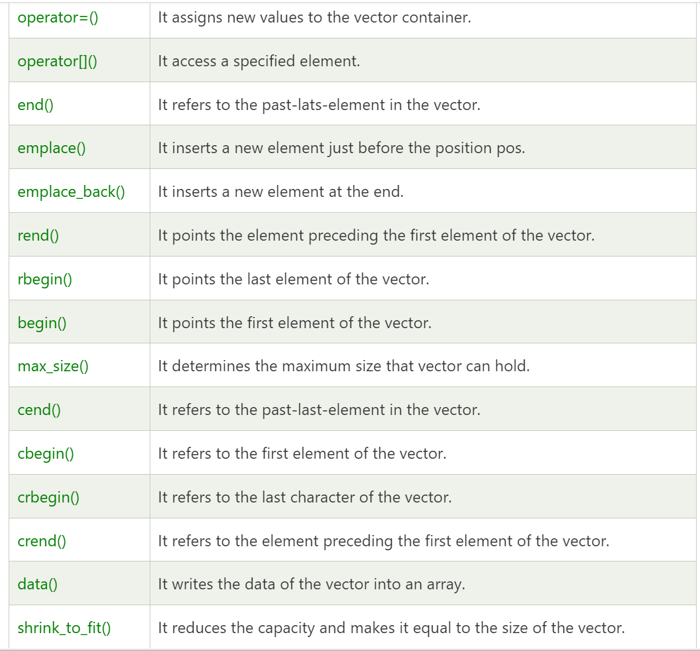

# Array

## Vector STL

- syntax

```cpp
vector<int>arr;
```

```cpp
vector<int>arr(n); // size
```

```cpp
vector<int>arr(n,-1);// size, value
```

# vector methods





## pair sum
```cpp

void pair_sum_bruteforce(int a[], int na, int b[], int nb,int target)
{   
    int ans[2];

    for (int i = 0; i < na; i++)
    {
        for(int j = 0;j<nb;j++){
            if(a[i]+b[j] == target){
                ans[0] = i;
                ans[1] = j;
                break;
            }
        }
    }

    cout<<ans[0]<<" "<<ans[1];
}
```
## find unique

- M1: All duplicate elements 2 times

```cpp
void findUnique(int arr[],int n){
    int ans = 0;

    for(int i = 0;i<n;i++){
        ans = ans^arr[i]; // xor
    }

    cout<<"unique element is "<<ans<<endl;
}

```
- M2: using Hash map

```cpp
int findUniqueHashing(int a[], int n, int k)
{
    int ans = -1;

    map<int, int> freqMap; // Create an unordered_map to store frequency

    // Populate the frequency map
    for (int i = 0; i < n; i++)
    {
        int num = a[i];
        freqMap[num]++; // Increment the frequency of the current element
    }

    for (auto it : freqMap)
    {
        // cout<<it.first<<"-> "<<it.second<<endl;
        if (it.second % k != 0)
        { // not multiple of k
            ans = it.first;
            break;
        }
    }

    return ans;
}
```
## Sort Zeros and Ones 
```cpp
void sortZeroAndOne(int arr[], int n)
{
    int i = 0, j = n - 1;

    while (i < j)
    {
        // cout<<i<<" "<<j<<endl;
        bool cond1 = (arr[i] == 0);
        bool cond2 = (arr[j] == 1);
        if (cond1)
        { // sahi jagh py hai
            i++;
        }
        if(cond2){
            j--;
        }
        
        if(!cond1 && !cond2){
            cout<<" cond"<<endl;
            swap(arr[i],arr[j]);
        }
    }
    
}

```


```cpp

```


```cpp

```


```cpp

```


```cpp

```


```cpp

```


```cpp

```


```cpp

```


```cpp

```


```cpp

```


```cpp

```


```cpp

```


```cpp

```


```cpp

```


```cpp

```


```cpp

```


```cpp

```


```cpp

```


```cpp

```


```cpp

```


```cpp

```


```cpp

```


```cpp

```


```cpp

```


```cpp

```


```cpp

```


```cpp

```


```cpp

```


```cpp

```


