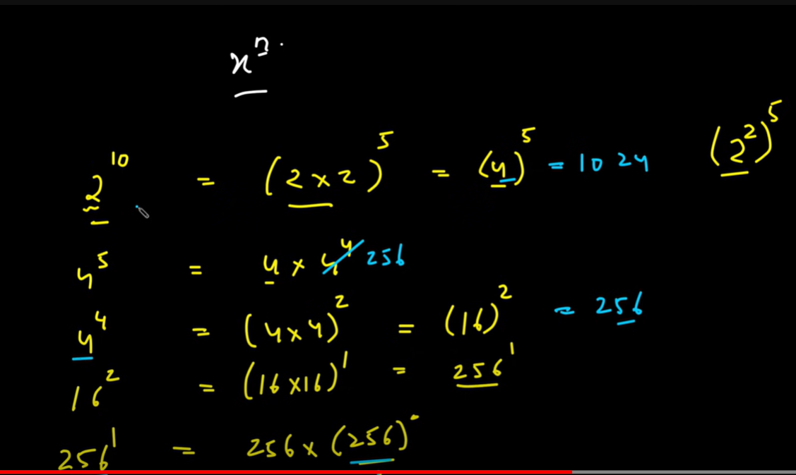
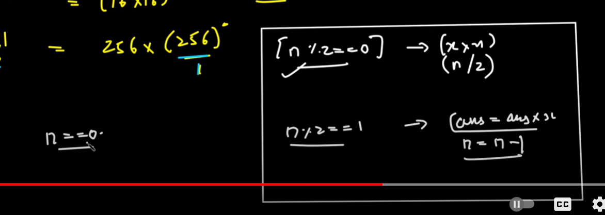

# binary exponention or implementation of pow function





- multiple value by itself and divide the exponent

- example 2^8 

- 2^8 = (2*2)^4 == (2*2)^8/2
- 4^4 = (4*4)^2 == (4*4)^4/2
- 16^2 = (16*16)^1 == (16*16)^2/2
- 16^1 = 16*16^0

- if power is in negative
- X^-n = 1/X^n so first find X^n then do 1/X^n

```cpp
double myPowBOptimized(double &x, int &n)
{
    long long int pow = n;
    double ans = 1.0;
    if(pow<0)
        pow =  -1*pow;
    while (pow > 0)
    {
        if (pow % 2 == 1)
        {
            // if power is even
            ans = ans * x;
            pow = pow - 1;
        }
        else
        {
            // pow even 2 4 6 8
            x = x * x;
            pow = pow / 2;
        }
    }
    if(n<0)
        ans =  1.0/ans;
    return ans;
}


```


# square root of a number

- approch - we will search the square root using Binary Search
- let say we have to find square root of n = 9 then we will find its square root in range 1 to 9
- 1 to 9 mid =  5 then mid*mid(25) > n then we decrease the search range 
- 1 to 5 mid = 3 , then 3*3 == n we got ans

- for precision we take the number in double and slightly change the Binary search condition

```cpp

int main()
{
    double esp = 1e-6;
    double x = 121;
    double lo = 0, hi = x, mid;

    while (hi - lo > esp) // to get precision till esp decimal
    {
        mid = (hi + lo)/2;
        if(mid * mid < x){
            lo = mid;
        }
        else{
            hi = mid;
        }
    }
    cout<<lo<<endl;
    cout<<hi<<endl;
    return 0;
}


```


```cpp

```


```cpp

```


```cpp

```


```cpp

```


```cpp

```


