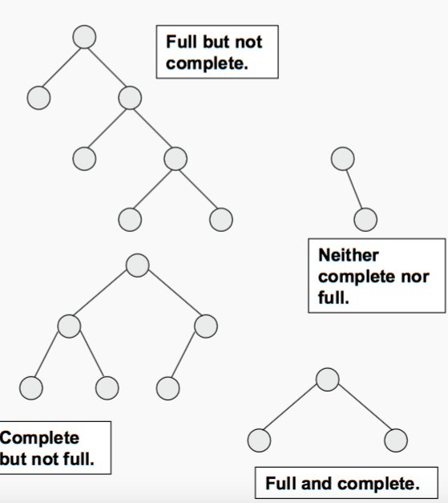
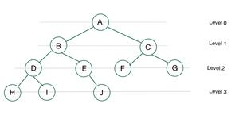
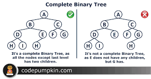
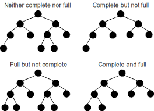

# Heap
- Data structure that is complete Binary Tree Plus Hold a Heap property
- All levels should be complete except last level and filling of node should be strictly from left to right 
- if right node is present without left node then it is not a complete Binary tree










```cpp

```

```cpp

```

```cpp

```

```cpp

```

```cpp

```

```cpp

```

```cpp

```

```cpp

```

```cpp

```

```cpp

```

```cpp

```

```cpp

```