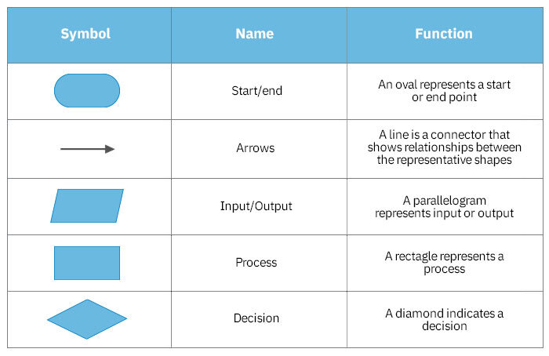

# Thought process to solve a problem

- step 1 understand the problem by reading 
- step 2 check input and output values
- step 3 go for approch 

- Algorithm : set of steps to complete any task
- flowchart : graphical representation of any algorithm

# Datatypes and variables

- size

- Question : why bool/char is of 1 byte , why not 1 bit 
- Answer : because it is the minimum memory we can use in system , maybe register is of minimum 1 byte

- Q : difference in float and double
- A : way of storing data is different , Float uses less memory but offers less precision, while double uses more memory but provides higher precision

- Q : how negative numbers stored in memory
- A : stored in form of 2's Complement form msb will be 1 for negative numbers and 0 for positive number

- 2's complement = 1's compliment + 1

- Q : how compiler decides how my bytes it has to take
- A : by data type

# Type casting
- implicit : conversion done automatically 
- Explicit : we have to convert the data type manually , gives error if not , eg: char = 96 is a explicit conversion

# Types of error

- syntax error
- runtime error
- logical error

# Namespace 
- used to organize code into logical groups and to prevent name collisions that can occur especially when your code base includes multiple libraries
- Example, you might be writing some code that has a function called xyz() and there is another library available which is also having same function xyz(). Now the compiler has no way of knowing which version of xyz()
