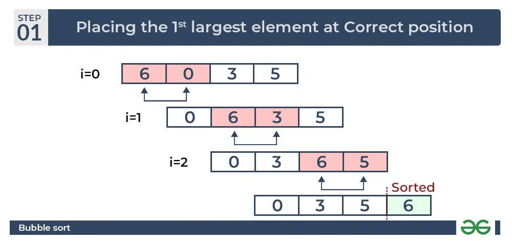
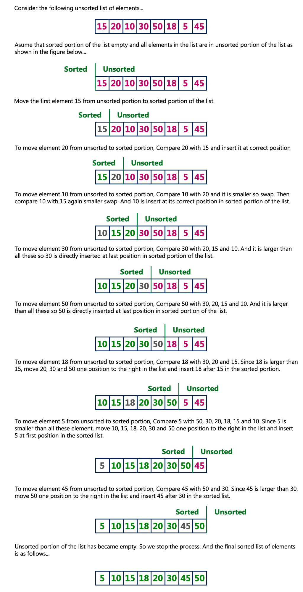
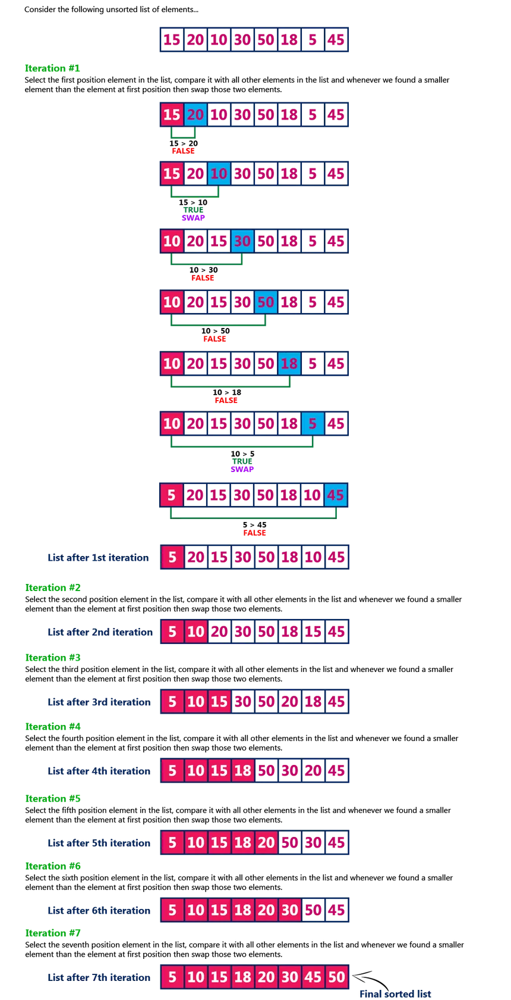
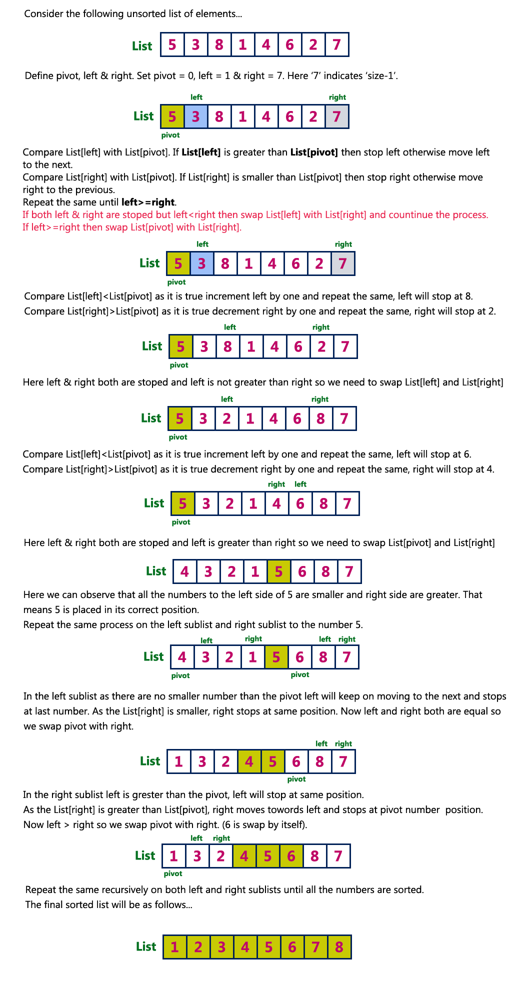
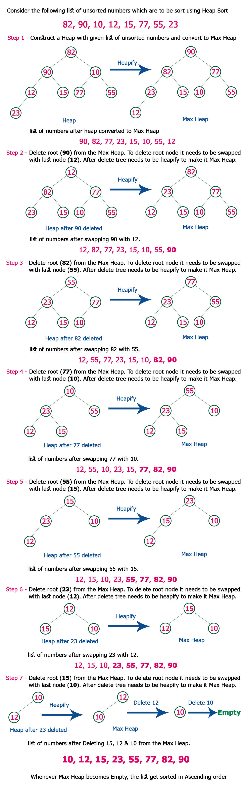

$${\color{white}W}$$

# Bubble Sort

- key idea is swap consecutive if they are in wrong order
- so in first order largest element will be pushed to end of array




```cpp

void bubbleSort(int arr[], int n)
{

    // phele baar my 0 sy n-1 tak ja rahe hai
    // second time 0 - n-2
    // ..
    // 0 - 1

    // so we are going n-1 to 1

    for (int i = n - 1; i >= 1; i--)
    {
        // 0 sy i tak

        // optimization - if no swap happens then array is sorted
        bool swapFlag = false;
        for (int j = 0; j <= i - 1; j++)
        {
            if (arr[j] > arr[j + 1])
            {
                // wrong order
                swap(arr[j], arr[j + 1]);
                swapFlag = true; // swapping happend
            }
        }

        if (!swapFlag)
        {
            break;
        }
    }
}


```

# Insertion Sort



```cpp

```

# Selection Sort

- what to select --> minimum 
- algorithm is all about get the minumum and swap it
- in 1 step or 1 iteration we will have least minmum at the starting 
- so we n-1 step to sort complete array , because remaing 1 element will be automatically sorted



```cpp

void selectionSort(int arr[], int n)
{
    for (int i = 0; i <= n - 2; i++)
    {
        int miniIndex = i;
        // get the minimum index
        for (int j = i; j <= n - 1; j++)
        {
            if (arr[j] < arr[miniIndex])
            {
                miniIndex = j;
            }
        }
        // swap with current index
        swap(arr[i], arr[miniIndex]);
    }
}


```

# Quick Sort



```cpp

```

# Heap Sort



```cpp

```

# merge Sort

```cpp

```

